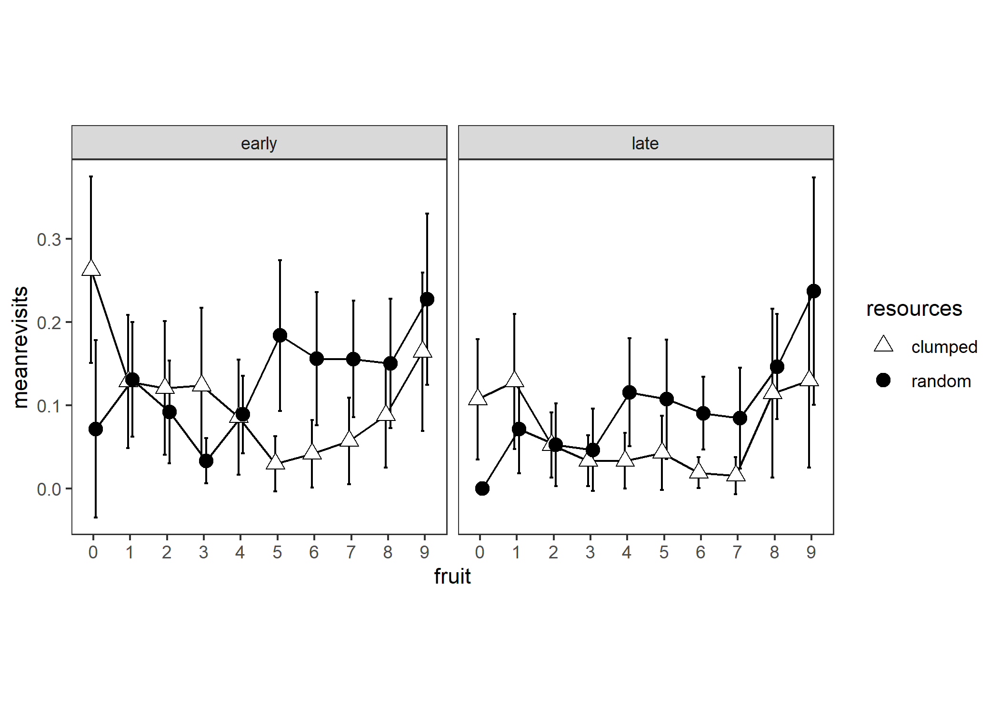

# Number of revisits grand analysis

Experiment 1

```{r e1_nrevisitsperfruit_setup, include=FALSE}
knitr::opts_chunk$set(echo = FALSE)
knitr::opts_chunk$set(fig.path='e1_figures/')
knitr::opts_chunk$set(fig.width=7, fig.height=5)
options(dplyr.summarise.inform=F)
library(tidyverse)
library(ez)
library(gt)

e1 <- readRDS("fgms_e1_allsubs.rds")
```

a 2 (resource distribution) x 2 (trial stage) x 14 (fruit consumed) analysis

```{r}
e1_nrevisits_grand <-
  e1 %>% 
  transmute(
    pp=pid,
    trial=trial_in_block,
    resources=R,
    stage=ifelse(trial_in_block<=5,"early","late"),
    index=index,
    tree=tile,
    fruit=basket,
    is_a_revisit=revisit) %>% 
  # number of revisits can't be greater than zero for the 10th fruit because we stop recording data as soon as they get to 10
  filter(fruit<10) %>% 
  mutate(fruit=as_factor(fruit),
         stage=as_factor(stage),
         resources=as_factor(resources))
```

Currently this df has multiple rows for each fruit - we want a single row for each fruit representing the count of revisits for that fruit

```{r}
e1_nrevisits_grand_FRUIT_SUMS <-
  e1_nrevisits_grand %>% 
  group_by(pp, resources, stage, trial, fruit) %>% 
  summarise(sumrevisits=sum(is_a_revisit))
```

Collapse over trials to get means per stage - each participant contributes one value per cell where a cell is 2 (resources) x 2 (stage) x 10 (fruit).

```{r}
e1_nrevisits_grand_PARTICIPANT_MEANS <-
  e1_nrevisits_grand_FRUIT_SUMS %>% 
  group_by(pp, resources, stage, fruit) %>% 
  summarise(meanrevisits=mean(sumrevisits))
```

```{r eval=F, echo=TRUE}
# not run
options(contrasts=c("contr.sum","contr.poly"))
e1_nrevisits_grand_ANOVA<-
  ezANOVA(data=e1_nrevisits_grand_PARTICIPANT_MEANS,
          dv=meanrevisits,
          wid=pp,
          within=c(resources,stage,fruit),
          type=3)
```

That yields:

> Error in ezANOVA_main(data = data, dv = dv, wid = wid, within = within,  : 
  One or more cells is missing data. Try using ezDesign() to check your data.
  
```{r e1ezDesign_bad_nrevisitsgrand_plot1}
ezDesign(data=e1_nrevisits_grand_PARTICIPANT_MEANS,x=fruit,y=pp,row=resources,col=stage)
```

So every time (5 times) participant 17 in clumped; and participants 37, 20, 12, 6 in random saw the first tree in the early stage it was a fruit, leading to no value for number of revisits, which constitutes a structural missing not an NA.

We replace structural missings with zero: after all, this is equivalent with saying that they didn't revisit any trees on their way to getting their first fruit, which is a true statement, even if it conceals that fact that they didn't have any _opportunities_ to revisit any trees on the way to getting their first fruit.

```{r}
e1_nrevisits_grand_PARTICIPANT_MEANS <-
  e1_nrevisits_grand_FRUIT_SUMS %>% 
  group_by(pp, resources, stage, fruit) %>% 
  summarise(meanrevisits=mean(sumrevisits))


e1_nrevisits_grand_PARTICIPANT_MEANS <-
  e1_nrevisits_grand_PARTICIPANT_MEANS %>% 
  ungroup() %>% 
  bind_rows(tibble(pp=factor(17),resources=factor("clumped"),stage=factor("early"),fruit=factor(0),meanrevisits=0)) %>% 
  bind_rows(tibble(pp=factor(37),resources=factor("random"),stage=factor("early"),fruit=factor(0),meanrevisits=0)) %>% 
  bind_rows(tibble(pp=factor(20),resources=factor("random"),stage=factor("early"),fruit=factor(0),meanrevisits=0)) %>% 
  bind_rows(tibble(pp=factor(12),resources=factor("random"),stage=factor("early"),fruit=factor(0),meanrevisits=0)) %>% 
  bind_rows(tibble(pp=factor(6),resources=factor("random"),stage=factor("early"),fruit=factor(0),meanrevisits=0)) %>% 
  group_by(pp, resources, stage, fruit) %>% 
  arrange(.by_group=TRUE)
```

```{r e1ezDesign_bad_nrevisitsgrand_plot2}
ezDesign(data=e1_nrevisits_grand_PARTICIPANT_MEANS,x=fruit,y=pp,row=resources,col=stage)
```

```{r e1nrevisitsanovatable, include=FALSE, fig.show='hide'}
options(contrasts=c("contr.sum","contr.poly"))
e1_nrevisits_grand_ANOVA<-
  ezANOVA(data=e1_nrevisits_grand_PARTICIPANT_MEANS,
          dv=meanrevisits,
          wid=pp,
          within=c(resources,stage,fruit),
          type=3)

e1_nrevisits_grand_ANOVA_TABLE <-
  e1_nrevisits_grand_ANOVA$ANOVA %>% 
  select(-ges) %>% 
  gt() %>% 
  tab_header(
    title="Number of revisits",
    subtitle = "ANOVA table"
  ) %>% 
  fmt_number(
    columns = c("F"),
    rows=everything(),
    decimals=2
  )  %>% 
  fmt_number(
    columns = c("p"),
    rows=everything(),
    decimals=3
  ) %>% 
  cols_align(
    columns=`p<.05`,
    align="c"
  )
gtsave(e1_nrevisits_grand_ANOVA_TABLE, "e1_tables/e1_nrevisits_grand_ANOVA.png")
```

```{r include=F}
e1_nrevisits_grand_PLOT10<-
ggplot(data=e1_nrevisits_grand_PARTICIPANT_MEANS, aes(x=fruit, y=meanrevisits, group=resources, pch=resources, fill=resources)) +
  facet_wrap(vars(stage))+
  theme_bw()+
  theme(aspect.ratio = 1, panel.grid=element_blank())+
  scale_fill_manual(values=c("white", "black")) +
  scale_shape_manual(values=c(24,19)) +
  stat_summary(fun.data = mean_cl_normal, geom = "errorbar", width=0.2, position=position_dodge(0.25)) +
  stat_summary(fun = mean, geom = "line", position=position_dodge(0.25)) + 
  stat_summary(fun = mean, geom = "point", size=3, position=position_dodge(0.25))
ggsave("e1_plots/e1_nrevisits_grand_PLOT10.png")
```

```{r out.width="50%"}
knitr::include_graphics("e1_tables/e1_nrevisits_grand_ANOVA.png")
```

```{r out.width="100%"}

```

* Now averaging over stage to give a plot of the resources X fruit interaction:

```{r e1_nrevisitsgrandfollowupresourcesXfruit, include=F}
dd <- e1_nrevisits_grand_PARTICIPANT_MEANS %>% 
  group_by(pp,resources,fruit) %>% 
  summarise(mean_revisits=mean(meanrevisits))
e1_nrevisits_grand_PLOT10resources_x_fruit <-
  ggplot(data=dd, aes(x=fruit, y=mean_revisits, group=resources, pch=resources, fill=resources)) +
   theme_bw()+
  theme(aspect.ratio = 1, panel.grid=element_blank())+
  scale_fill_manual(values=c("white", "black")) +
  scale_shape_manual(values=c(24,19)) +
  stat_summary(fun.data = mean_cl_normal, geom = "errorbar", width=0.2, position=position_dodge(0.25)) +
  stat_summary(fun = mean, geom = "line", position=position_dodge(0.25)) + 
  stat_summary(fun = mean, geom = "point", size=3, position=position_dodge(0.25))
ggsave("e1_plots/e1_nrevisits_grand_PLOT10resources_x_fruit.png")
```

```{r out.width="100%"}
knitr::include_graphics("e1_plots/e1_nrevisits_grand_PLOT10resources_x_fruit.png")
```

