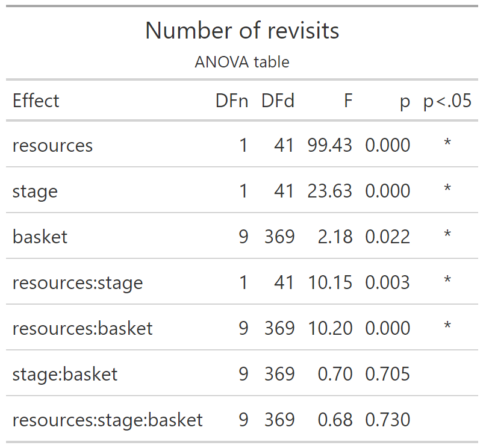

# Number of revisits

Experiment 1

```{r e1_nrevisitsperfruit_setup, include=FALSE}
knitr::opts_chunk$set(echo = TRUE)
knitr::opts_chunk$set(fig.path='e1_figures/')
knitr::opts_chunk$set(fig.width=7, fig.height=5)
options(dplyr.summarise.inform=F)
require(Hmisc)
library(tidyverse)
library(ez)
library(gt)
```

This is a 2 (resource distribution) x 2 (trial stage) x 10 (sequential fruit consumed) analysis.

## Form the dataset

```{r}
e1.raw <- readRDS("001-00-e1-data.RDS")
e1.sub <- e1.raw %>% select(pp, rr, tb, ix, tl, fl, fr)
e1.ann <- e1.sub %>% 
  # remove samples that did not look at a tree
  filter(fl>0) %>% select(-fl) %>% 
  # identify consecutive dupes for removal
  group_by(pp, rr, tb) %>% mutate(dupe = !(is.na(tl != lag(tl)) | tl != lag(tl))) %>% ungroup %>% 
  # remove dupes
  filter(dupe==FALSE) %>% 
  # annotate with revisit
  group_by(pp, rr, tb) %>% mutate(isrv = duplicated(tl)) %>% ungroup() %>% 
  # annotate with max fruit
  group_by(pp, rr, tb) %>% mutate(maxf = max(fr)) %>% ungroup() %>% 
  # remove samples in the tenth fruit
  filter(fr !=10) 

# make sure each trial has an entry for the zeroth fruit
merge_me = expand_grid(pp = sort(unique(e1.ann$pp)), rr = sort(unique(e1.ann$rr)), tb = sort(unique(e1.ann$tb)), fr = 0)
e1.ann2 <- full_join(e1.ann, merge_me, by = join_by(pp, rr, tb, fr)) %>% arrange(pp, rr, tb, fr)

# redo isrv such that the zeroth fruit has FALSE for isrv instead of NA
e1.ann2 <- e1.ann2 %>% replace_na(list(isrv=FALSE))

# redo maxf to replace NA with whatever the max was for that trial
e1.ann2 <- e1.ann2 %>% group_by(pp,rr,tb) %>% mutate(maxf=max(maxf, na.rm=TRUE)) %>% ungroup()

# remove trials with maxf less than 10
e1.ann3 <- e1.ann2 %>% filter(maxf == 10)

# add stage
e1.ann3 <- e1.ann3 %>% mutate(st=ifelse(tb<=5, "early", "late"))

# aggregate such that there is a row for each fruit visited (including the zeroth but not the tenth)
# saying how many (sum) revisits there were while searching for that fruit
e1.agg1 <- e1.ann3 %>% 
  group_by(pp, rr, st, tb, fr) %>% 
  summarise(nrev=sum(isrv)) %>% 
  ungroup()

# aggregate over trials to give mean sum revisits at the relevant fruit for each stage
e1.agg2 <- e1.agg1 %>% 
  group_by(pp, rr, st, fr) %>% 
  summarise(murev=mean(nrev)) %>% 
  ungroup()


dd = e1.agg2
dd <- dd %>% mutate(pp=as_factor(pp), rr=as_factor(rr), st=as_factor(st), fr=as_factor(fr))
```

ANOVA now

```{r e1nrevisitsanovatable, include=FALSE, fig.show='hide'}
e1_nrevisits_grand_ANOVA <-
  ezANOVA(data=dd, dv=murev, wid=pp, within=c(rr, st, fr), type=3)

e1_nrevisits_grand_ANOVA_TABLE <-
  e1_nrevisits_grand_ANOVA$ANOVA %>% 
  select(-ges) %>% 
  gt() %>% 
  tab_header(
    title="Number of revisits",
    subtitle = "ANOVA table"
  ) %>% 
  fmt_number(
    columns = c("F"),
    rows=everything(),
    decimals=2
  )  %>% 
  fmt_number(
    columns = c("p"),
    rows=everything(),
    decimals=3
  ) %>% 
  cols_align(
    columns=`p<.05`,
    align="center"
  )
gtsave(e1_nrevisits_grand_ANOVA_TABLE, "e1_tables/e1_nrevisits_grand_ANOVA.png")
```

This is the ANOVA table

```{r out.width="50%"}

```

----

## Means

### Significant stage effect means

Now we want grand means for the significant stage effect.

```{r}
stage_means = dd %>% 
  group_by(st, pp, rr, fr) %>% 
  summarise(mu=mean(murev)) %>% 
  summarise(mu=mean(mu)) %>% 
  summarise(mu=mean(mu)) %>% 
  summarise(mean=mean(mu), sd=sd(mu)) %>% 
  mutate(mean=round(mean,2), sd=round(sd,2))
stage_means %>% knitr::kable()
```

### Significant fruit effect means

```{r}
fruit_means = dd %>% 
  group_by(fr, pp, rr, st) %>% 
  summarise(mu=mean(murev)) %>% 
  summarise(mu=mean(mu)) %>% 
  summarise(mu=mean(mu)) %>% 
  summarise(mean=mean(mu), sd=sd(mu)) %>%
  mutate(mean=round(mean,2), sd=round(sd,2))
# We report the first and tenth value
fruit_means %>% filter(fr%in%c(0,9)) %>% knitr::kable()
```


The average number of revisits made while searching for the first fruit item was 
`r fruit_means[1,2]` +/- `r fruit_means[1,3]`. 
The average number of revisits made while searching for the last fruit item was 
`r fruit_means[10,2]` +/- `r fruit_means[10,3]`. 

----

## Interaction plots

### Stage x Resources

We write code for the plot of the stage x resources interaction. The stage effect is significant but the interaction isn't.

```{r, e1nrevisits}
data_for_plot <-
  dd %>% group_by(st, rr, pp) %>%
  summarise(mean_revisits=mean(murev))
pd <- position_dodge(0.1)
require(Hmisc)
e1_nrevisits_grand_PLOT <-
  ggplot(data=data_for_plot, aes(x=st, y=mean_revisits, group=rr, pch=rr, fill=rr))+
  theme_bw()+
  theme(aspect.ratio = 1, panel.grid=element_blank(), axis.title.y=element_text(angle=0,vjust=0.5,hjust=0.5))+
  scale_fill_manual(name="Resource\ndistribution",values=c("white", "black")) +
  scale_shape_manual(name="Resource\ndistribution",values=c(24,19)) +
  stat_summary(fun.data = mean_cl_normal, geom = "errorbar", width=0.1, position=pd) +
  stat_summary(fun = mean, geom = "line", position=pd) +
  stat_summary(fun = mean, geom = "point", size=4, position=pd)+
  ggtitle("Number of Revisits")+
  ylab("Number\nof\nRevisits")+
  xlab("Trial")+
  scale_x_discrete(labels=c("early\ntrials 1 to 5", "late\ntrials 6 to 10"))
e1_nrevisits_grand_PLOT
```

