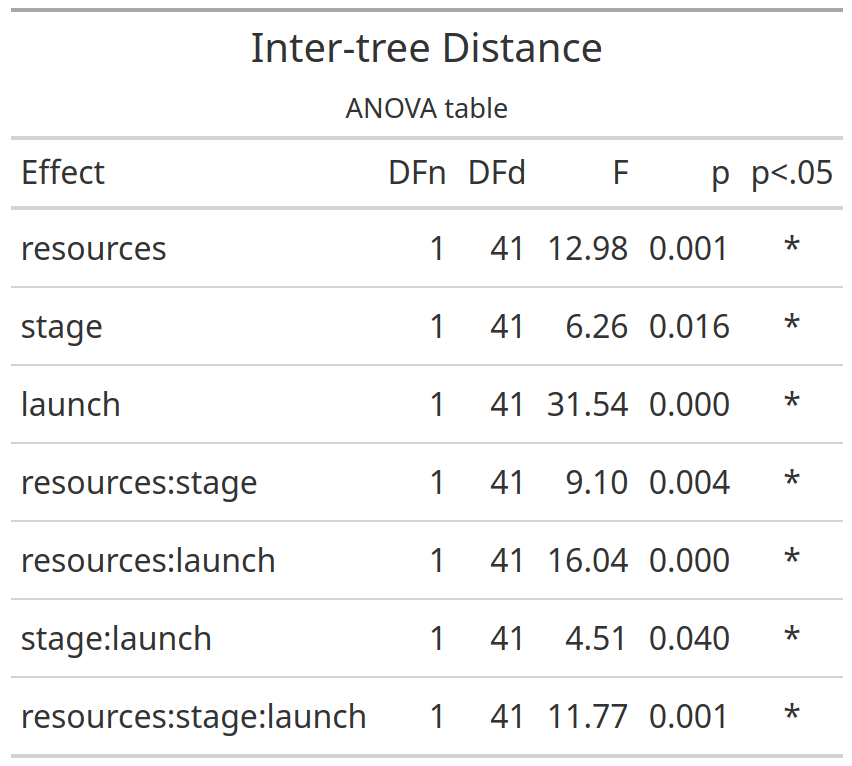
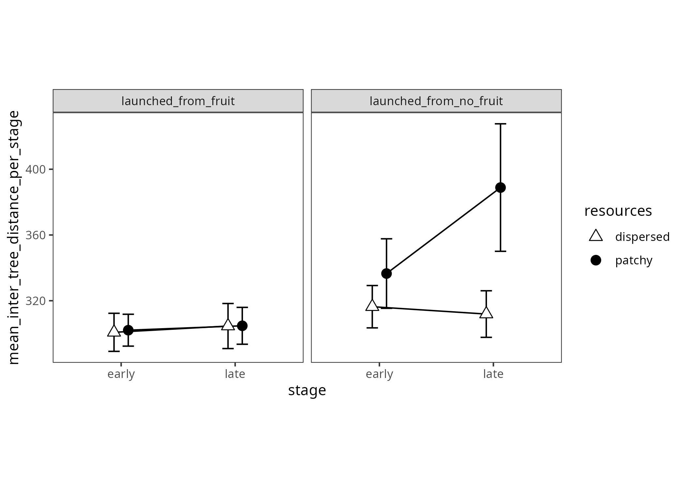

# Inter-tree distance

Experiment 1

```{r e1_inter_tree_distance_setup, include=FALSE}
knitr::opts_chunk$set(echo = FALSE)
knitr::opts_chunk$set(fig.path='e1_figures/')
knitr::opts_chunk$set(fig.width=7, fig.height=5)
options(dplyr.summarise.inform=F)
library(tidyverse)
library(ez)
library(gt)

e1 <- readRDS("001-00-e1-data.RDS")

e1_inter_tree_distance <-
  e1 %>%
  transmute(
    pp           = as_factor(pp),
    trial        = as.numeric(tb), # is 1 to 10 for each condition of "resources"
    resources    = factor(rr, levels=c("dispersed", "patchy"), labels=c("dispersed", "patchy")),
    launch       = factor(ll, levels=c("fruit", "not"), labels=c("launched_from_fruit", "launched_from_no_fruit")),
    stage        = as_factor(ifelse(trial<=5, "early", "late")),
    xx           = xx,
    yy           = yy,
    index        = ix)

# bear in mind that it needs to be done after reducing the data to valid tree-visits
e1_inter_tree_distance <- e1_inter_tree_distance %>% 
  mutate(itdist = round(sqrt((lead(xx)-xx)^2 + (lead(yy)-yy)^2), 2))

e1_inter_tree_distance_TRIAL_VALUES <- 
  e1_inter_tree_distance %>% 
  group_by(pp, resources, stage, launch, trial) %>% 
  summarise(inter_tree_distance=mean(itdist, na.rm=TRUE))

e1_inter_tree_distance_PARTICIPANT_MEANS <-
  e1_inter_tree_distance_TRIAL_VALUES %>% 
  group_by(pp, resources, stage, launch) %>% 
  summarise(mean_inter_tree_distance_per_stage = mean(inter_tree_distance))


options(contrasts=c("contr.sum","contr.poly"))
e1_inter_tree_distance_ANOVA <- 
  ezANOVA(data=e1_inter_tree_distance_PARTICIPANT_MEANS,
          dv=mean_inter_tree_distance_per_stage,
          wid=pp,
          within=c(resources,stage,launch),
          type=3)

e1_inter_tree_distance_ANOVA_TABLE <-
  e1_inter_tree_distance_ANOVA$ANOVA %>% 
  select(-ges) %>% 
  gt() %>% 
  tab_header(
    title="Inter-tree Distance",
    subtitle = "ANOVA table"
  ) %>% 
  fmt_number(
    columns = c("F"),
    rows=everything(),
    decimals=2
  )  %>% 
  fmt_number(
    columns = c("p"),
    rows=everything(),
    decimals=3
  ) %>% 
  cols_align(
    columns=`p<.05`,
    align="center" 
  )
gtsave(e1_inter_tree_distance_ANOVA_TABLE, "e1_tables/e1_inter_tree_distance_ANOVA.png")


# Two points along the x axis, each participant contributes one point per cell
e1_inter_tree_distance_PLOT2 <-
  ggplot(
  data=e1_inter_tree_distance_PARTICIPANT_MEANS, 
  aes(x=stage, y=mean_inter_tree_distance_per_stage, group=launch, pch=launch, fill=launch)
) +
  facet_wrap(~resources)+
  theme_bw()+
  theme(aspect.ratio = 1, panel.grid=element_blank())+
  scale_fill_manual(values=c("white", "black")) +
  scale_shape_manual(values=c(24,19)) +
  stat_summary(fun.data = mean_cl_normal, geom = "errorbar", width=0.2, position=position_dodge(0.25)) +
  stat_summary(fun = mean, geom = "line", position=position_dodge(0.25)) + 
  stat_summary(fun = mean, geom = "point", size=3, position=position_dodge(0.25))
ggsave("e1_plots/e1_inter_tree_distance_PLOT2.png")
```

```{r out.width="50%"}

```

```{r out.width="100%"}

```

