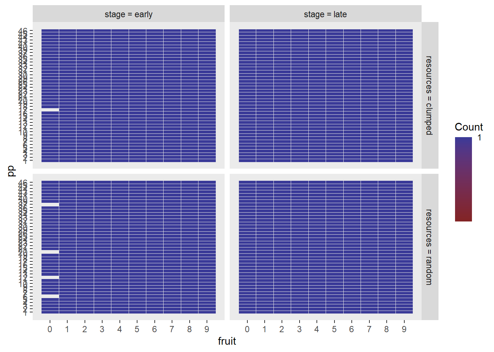
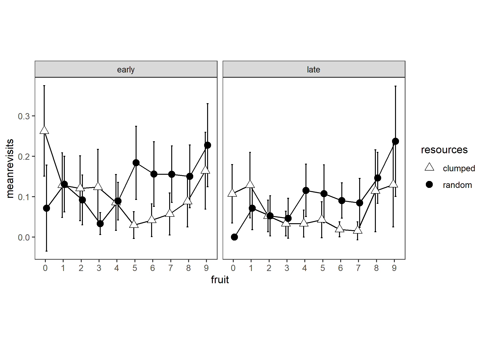

# Number of revisits grand analysis

Experiment 1


a 2 (resource distribution) x 2 (trial stage) x 14 (fruit consumed) analysis


Currently this df has multiple rows for each fruit - we want a single row for each fruit representing the count of revisits for that fruit


Collapse over trials to get means per stage - each participant contributes one value per cell where a cell is 2 (resources) x 2 (stage) x 10 (fruit).


```r
# not run
options(contrasts=c("contr.sum","contr.poly"))
e1_nrevisits_grand_ANOVA<-
  ezANOVA(data=e1_nrevisits_grand_PARTICIPANT_MEANS,
          dv=meanrevisits,
          wid=pp,
          within=c(resources,stage,fruit),
          type=3)
```

That yields:

> Error in ezANOVA_main(data = data, dv = dv, wid = wid, within = within,  : 
  One or more cells is missing data. Try using ezDesign() to check your data.
  


So every time (5 times) participant 17 in clumped; and participants 37, 20, 12, 6 in random saw the first tree in the early stage it was a fruit, leading to no value for number of revisits, which constitutes a structural missing not an NA.

We replace structural missings with zero: after all, this is equivalent with saying that they didn't revisit any trees on their way to getting their first fruit, which is a true statement, even if it conceals that fact that they didn't have any _opportunities_ to revisit any trees on the way to getting their first fruit.




* Now averaging over stage to give a plot of the resources X stage interaction:


