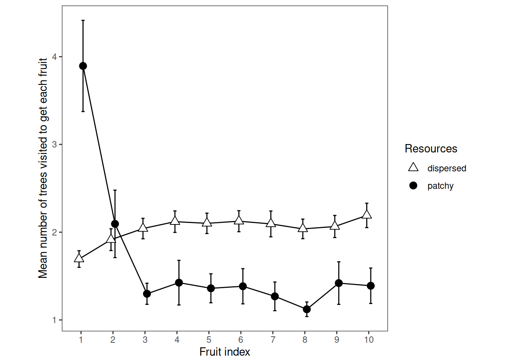

# Retrieval Rate

Experiment 1


```r
e1 <- readRDS("001-00-e1-data.RDS")

# remove things from the raw data to make it suitable for this particular analysis

# remove samples that did not look at a tree
e1 <- e1 %>% filter(fl>0)

# remove the second (and any subsequent) *consecutive* duplicates
e1 <- e1 %>% 
  group_by(pp, rr, tb) %>% 
  filter(is.na(tl != lag(tl)) | tl != lag(tl)) %>% 
  ungroup()

# remove trials where they failed to get 10 fruit
e1 <- e1 %>% 
  group_by(pp, te) %>% 
  mutate(max_fr = max(fr)) %>% 
  ungroup() %>% 
  filter(max_fr==10)

# how many trees to get each fruit?
# this is neat and it needs to be done after reducing the data to row-per-valid-tree-visit
e1$ntrees_to_get_a_fruit = NA
j = 0
for (k in seq_along(e1$ix)) {
 j = j + 1
 if (e1[k, 'fl']==2) {
   e1[k, 'ntrees_to_get_a_fruit'] = j
   j = 0
 }
}

# remove any remaining NAs
e1 <- e1 %>% filter(!is.na(ntrees_to_get_a_fruit))

# average over trials (and ignore stage) to yield participant means suitable for ggplot and ANOVA
rtv = e1 %>% 
  select(pp, rr, tb, fr, ntrees_to_get_a_fruit) %>% 
  group_by(pp, rr, fr) %>% 
  summarise(mu=mean(ntrees_to_get_a_fruit)) %>% 
  ungroup() %>% 
  mutate(pp=as_factor(pp), rr=as_factor(rr), fr=as_factor(fr))

saveRDS(rtv, "e1_retrieval_plot_data.rds")
```

## ANOVA


```r
options(contrasts=c("contr.sum","contr.poly"))
e1_retrievalrate_ANOVA <- 
  ezANOVA(data=rtv,
          dv=mu,
          wid=pp,
          within=c(rr, fr),
          type=3, return_aov = TRUE)

prettify_anova(e1_retrievalrate_ANOVA, "Retrieval rate")
```

<table class="table" style="width: auto !important; ">
<caption>(\#tab:unnamed-chunk-2)Retrieval rate</caption>
 <thead>
  <tr>
   <th style="text-align:left;"> Effect </th>
   <th style="text-align:right;"> DFn </th>
   <th style="text-align:right;"> DFd </th>
   <th style="text-align:right;"> F </th>
   <th style="text-align:left;"> p </th>
   <th style="text-align:left;"> sig </th>
  </tr>
 </thead>
<tbody>
  <tr>
   <td style="text-align:left;"> rr </td>
   <td style="text-align:right;"> 1 </td>
   <td style="text-align:right;"> 41 </td>
   <td style="text-align:right;"> 54.14 </td>
   <td style="text-align:left;"> 0.000 </td>
   <td style="text-align:left;"> *** </td>
  </tr>
  <tr>
   <td style="text-align:left;"> fr </td>
   <td style="text-align:right;"> 9 </td>
   <td style="text-align:right;"> 369 </td>
   <td style="text-align:right;"> 22.99 </td>
   <td style="text-align:left;"> 0.000 </td>
   <td style="text-align:left;"> *** </td>
  </tr>
  <tr>
   <td style="text-align:left;"> rr:fr </td>
   <td style="text-align:right;"> 9 </td>
   <td style="text-align:right;"> 369 </td>
   <td style="text-align:right;"> 46.85 </td>
   <td style="text-align:left;"> 0.000 </td>
   <td style="text-align:left;"> *** </td>
  </tr>
</tbody>
</table>

```r
prettify_anova(aovSphericityAdjustment(e1_retrievalrate_ANOVA), "Retrieval rate")
```

<table class="table" style="width: auto !important; ">
<caption>(\#tab:unnamed-chunk-2)Retrieval rate</caption>
 <thead>
  <tr>
   <th style="text-align:left;"> Effect </th>
   <th style="text-align:right;"> DFn </th>
   <th style="text-align:right;"> DFd </th>
   <th style="text-align:right;"> F </th>
   <th style="text-align:left;"> p </th>
   <th style="text-align:left;"> sig </th>
  </tr>
 </thead>
<tbody>
  <tr>
   <td style="text-align:left;"> rr </td>
   <td style="text-align:right;"> 1.0 </td>
   <td style="text-align:right;"> 41.0 </td>
   <td style="text-align:right;"> 54.14 </td>
   <td style="text-align:left;"> 0.000 </td>
   <td style="text-align:left;"> *** </td>
  </tr>
  <tr>
   <td style="text-align:left;"> fr </td>
   <td style="text-align:right;"> 3.9 </td>
   <td style="text-align:right;"> 160.4 </td>
   <td style="text-align:right;"> 22.99 </td>
   <td style="text-align:left;"> 0.000 </td>
   <td style="text-align:left;"> *** </td>
  </tr>
  <tr>
   <td style="text-align:left;"> rr:fr </td>
   <td style="text-align:right;"> 4.8 </td>
   <td style="text-align:right;"> 197.9 </td>
   <td style="text-align:right;"> 46.85 </td>
   <td style="text-align:left;"> 0.000 </td>
   <td style="text-align:left;"> *** </td>
  </tr>
</tbody>
</table>


The effect of fruit ($F(9, 369) = 22.99$, $p < .001$, $\hat{\eta}^2_G = .204$, 90\% CI $[.133, .250]$)

The effect of fruit after Greenhouse-Geisser correction for sphericity violation was F(3.91, 160.43) = 22.99, p< .001

The fruit x resources interaction after Greenhouse-Geisser correction for sphericity violation was F(4.83, 197.91) = 46.85, p< .001


## Plot


```r
# Ten points along the x axis, each participant contributes one point per cell

ggplot(
  data=rtv, 
  aes(x=fr, y=mu, group=rr, pch=rr, fill=rr)
) +
  theme_bw()+
  theme(aspect.ratio = 1, panel.grid=element_blank())+
  scale_fill_manual(name="Resources", values=c("white", "black")) +
  scale_shape_manual(name="Resources", values=c(24,19)) +
  stat_summary(fun.data = mean_cl_normal, geom = "errorbar", width=0.2, position=position_dodge(0.25)) +
  stat_summary(fun = mean, geom = "line", position=position_dodge(0.25)) + 
  stat_summary(fun = mean, geom = "point", size=3, position=position_dodge(0.25))+
  ylab("Mean number of trees visited to get each fruit")+
  xlab("Fruit index")
```



## Resources Means


```r
rrpremeans = rtv %>% group_by(rr, pp, fr) %>%
  summarise(mu=mean(mu)) %>% 
  summarise(mu=mean(mu)) 
rrmeans <- rrpremeans %>% 
  summarise(mean=mean(mu), sd=sd(mu))
prettify_means(rrmeans, "stage means")
```

<table class="table" style="width: auto !important; ">
<caption>(\#tab:unnamed-chunk-4)stage means</caption>
 <thead>
  <tr>
   <th style="text-align:left;"> rr </th>
   <th style="text-align:right;"> mean </th>
   <th style="text-align:right;"> sd </th>
  </tr>
 </thead>
<tbody>
  <tr>
   <td style="text-align:left;"> dispersed </td>
   <td style="text-align:right;"> 2.04 </td>
   <td style="text-align:right;"> 0.13 </td>
  </tr>
  <tr>
   <td style="text-align:left;"> patchy </td>
   <td style="text-align:right;"> 1.67 </td>
   <td style="text-align:right;"> 0.30 </td>
  </tr>
</tbody>
</table>

## Fruit means


```r
frpremeans = rtv %>% group_by(fr, pp, rr) %>%
  summarise(mu=mean(mu)) %>% 
  summarise(mu=mean(mu))  
frmeans <- frpremeans %>% 
  summarise(mean=mean(mu), sd=sd(mu))
prettify_means(frmeans, "fruit means")
```

<table class="table" style="width: auto !important; ">
<caption>(\#tab:unnamed-chunk-5)fruit means</caption>
 <thead>
  <tr>
   <th style="text-align:left;"> fr </th>
   <th style="text-align:right;"> mean </th>
   <th style="text-align:right;"> sd </th>
  </tr>
 </thead>
<tbody>
  <tr>
   <td style="text-align:left;"> 1 </td>
   <td style="text-align:right;"> 2.79 </td>
   <td style="text-align:right;"> 0.90 </td>
  </tr>
  <tr>
   <td style="text-align:left;"> 2 </td>
   <td style="text-align:right;"> 2.00 </td>
   <td style="text-align:right;"> 0.63 </td>
  </tr>
  <tr>
   <td style="text-align:left;"> 3 </td>
   <td style="text-align:right;"> 1.67 </td>
   <td style="text-align:right;"> 0.28 </td>
  </tr>
  <tr>
   <td style="text-align:left;"> 4 </td>
   <td style="text-align:right;"> 1.77 </td>
   <td style="text-align:right;"> 0.44 </td>
  </tr>
  <tr>
   <td style="text-align:left;"> 5 </td>
   <td style="text-align:right;"> 1.73 </td>
   <td style="text-align:right;"> 0.36 </td>
  </tr>
  <tr>
   <td style="text-align:left;"> 6 </td>
   <td style="text-align:right;"> 1.75 </td>
   <td style="text-align:right;"> 0.38 </td>
  </tr>
  <tr>
   <td style="text-align:left;"> 7 </td>
   <td style="text-align:right;"> 1.68 </td>
   <td style="text-align:right;"> 0.35 </td>
  </tr>
  <tr>
   <td style="text-align:left;"> 8 </td>
   <td style="text-align:right;"> 1.58 </td>
   <td style="text-align:right;"> 0.20 </td>
  </tr>
  <tr>
   <td style="text-align:left;"> 9 </td>
   <td style="text-align:right;"> 1.74 </td>
   <td style="text-align:right;"> 0.44 </td>
  </tr>
  <tr>
   <td style="text-align:left;"> 10 </td>
   <td style="text-align:right;"> 1.79 </td>
   <td style="text-align:right;"> 0.38 </td>
  </tr>
</tbody>
</table>

