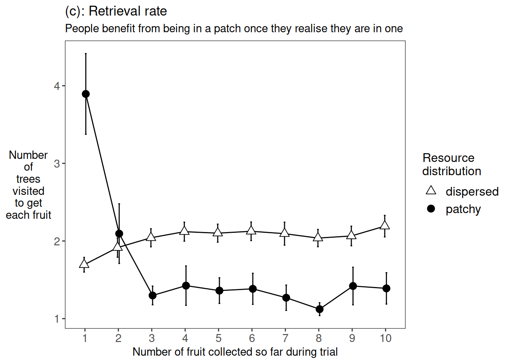

# Master plot, e1


```r
pd <- position_dodge(0.1)
my_fgms_theme =  theme_bw()+
  theme(
  panel.grid        = element_blank(), 
  axis.title.y      = element_text(angle=0, vjust=0.5, hjust=0.5), 
  legend.text       = element_text(size=12), 
  legend.title      = element_text(size=12), 
  axis.text         = element_text(size=11),
  strip.background  = element_blank(),
  strip.text        = element_text(size=11)
)
```


```r
retrieval_data <- readRDS("e1_retrieval_plot_data.rds") 
  
p3=ggplot(data=retrieval_data, aes(y=mu, x=fr, group=rr, fill=rr, shape=rr))+
  labs(title="(c): Retrieval rate", subtitle="People benefit from being in a patch once they realise they are in one")+
  ylab("Number\nof\ntrees\nvisited\nto get\neach fruit")+
  xlab("Number of fruit collected so far during trial")+
  my_fgms_theme+  
  scale_fill_manual(name="Resource\ndistribution",values=c("white", "black")) +
  scale_shape_manual(name="Resource\ndistribution",values=c(24,19)) +
  stat_summary(fun.data = mean_cl_normal, geom = "errorbar", width=0.1, position=pd) +
  stat_summary(fun = mean, geom = "line", position=pd) + 
  stat_summary(fun = mean, geom = "point", size=3, position=pd)
```


```r
p3
```




```r
pp=(p1+p2)/p3/p4 + 
  plot_layout(heights = c(1, 1, 1), guides="collect") +
  plot_annotation(title = 'Figure 2: Experiment One measures')

ggsave(plot = pp, filename="e1-99-master_plot.png",height=12,width=9)
```

