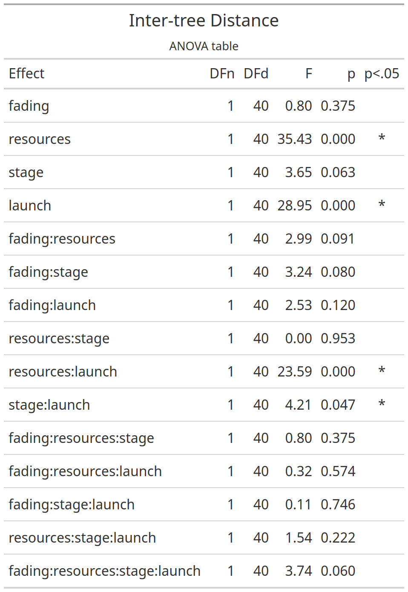
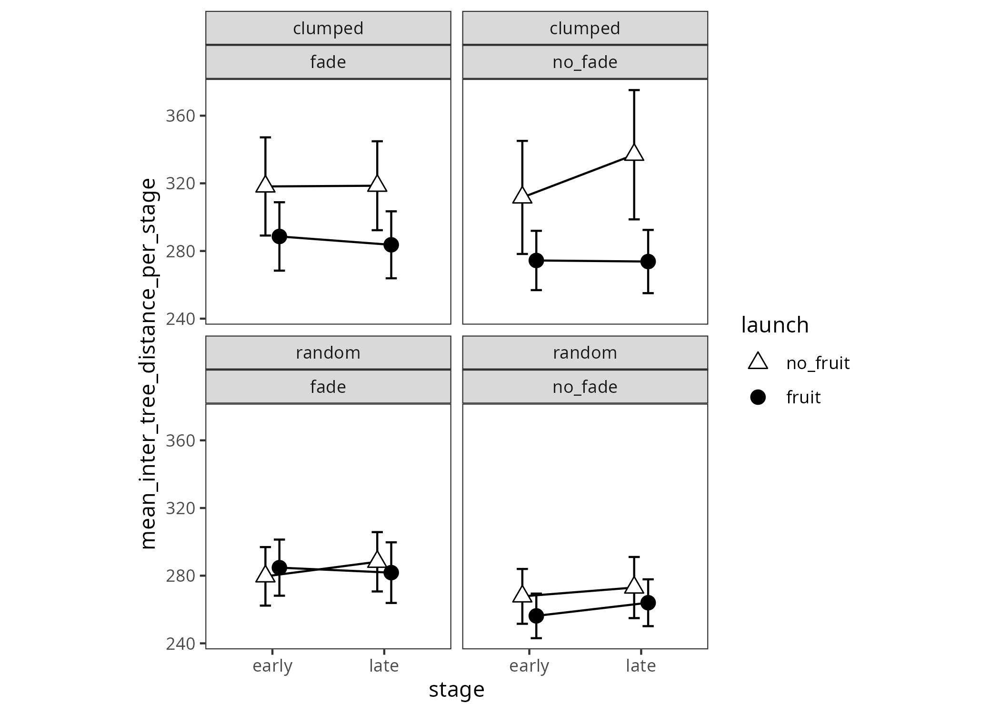

# Inter-tree Distance

Experiment 2






# Print all means.

# Need the 3-way means tables to be generated

* e2_inter_tree_distance_RESOURCES_STAGE_FADING_MEANS
* e2_inter_tree_distance_RESOURCES_STAGE_LAUNCH_MEANS
* e2_inter_tree_distance_RESOURCES_FADING_LAUNCH_MEANS
* e2_inter_tree_distance_RESOURCES_STAGE_FADING_MEANS


```
#> # A tibble: 16 × 6
#> # Groups:   resources, stage, fading [8]
#>    resources stage fading  launch                 mean    sd
#>    <fct>     <fct> <fct>   <fct>                 <dbl> <dbl>
#>  1 clumped   early fade    launched_from_fruit    289.  45.6
#>  2 clumped   early fade    launched_from_no_fru…  318.  65.4
#>  3 clumped   early no_fade launched_from_fruit    274.  37.4
#>  4 clumped   early no_fade launched_from_no_fru…  312.  71.4
#>  5 clumped   late  fade    launched_from_fruit    284.  44.6
#>  6 clumped   late  fade    launched_from_no_fru…  319.  59.3
#>  7 clumped   late  no_fade launched_from_fruit    274.  39.9
#>  8 clumped   late  no_fade launched_from_no_fru…  337.  81.7
#>  9 random    early fade    launched_from_fruit    285.  37.4
#> 10 random    early fade    launched_from_no_fru…  280.  39.0
#> 11 random    early no_fade launched_from_fruit    256.  28.2
#> 12 random    early no_fade launched_from_no_fru…  268.  34.6
#> 13 random    late  fade    launched_from_fruit    282.  40.4
#> 14 random    late  fade    launched_from_no_fru…  288.  39.6
#> 15 random    late  no_fade launched_from_fruit    264.  29.6
#> 16 random    late  no_fade launched_from_no_fru…  273.  38.6
```


```
#> # A tibble: 8 × 5
#> # Groups:   resources, fading [4]
#>   resources fading  launch                  mean    sd
#>   <fct>     <fct>   <fct>                  <dbl> <dbl>
#> 1 clumped   fade    launched_from_fruit     286.  44.7
#> 2 clumped   fade    launched_from_no_fruit  318.  61.7
#> 3 clumped   no_fade launched_from_fruit     274.  38.2
#> 4 clumped   no_fade launched_from_no_fruit  324.  76.8
#> 5 random    fade    launched_from_fruit     283.  38.5
#> 6 random    fade    launched_from_no_fruit  284.  39.1
#> 7 random    no_fade launched_from_fruit     260.  28.8
#> 8 random    no_fade launched_from_no_fruit  270.  36.3
```


```
#> # A tibble: 8 × 5
#> # Groups:   resources, stage [4]
#>   resources stage launch                  mean    sd
#>   <fct>     <fct> <fct>                  <dbl> <dbl>
#> 1 clumped   early launched_from_fruit     282.  42.0
#> 2 clumped   early launched_from_no_fruit  315.  67.6
#> 3 clumped   late  launched_from_fruit     279.  42.2
#> 4 clumped   late  launched_from_no_fruit  327.  70.5
#> 5 random    early launched_from_fruit     271.  36.0
#> 6 random    early launched_from_no_fruit  274.  37.0
#> 7 random    late  launched_from_fruit     273.  36.4
#> 8 random    late  launched_from_no_fruit  281.  39.4
```


```
#> # A tibble: 8 × 5
#> # Groups:   stage, fading [4]
#>   stage fading  launch                  mean    sd
#>   <fct> <fct>   <fct>                  <dbl> <dbl>
#> 1 early fade    launched_from_fruit     287.  41.3
#> 2 early fade    launched_from_no_fruit  299.  56.7
#> 3 early no_fade launched_from_fruit     265.  34.0
#> 4 early no_fade launched_from_no_fruit  290.  59.7
#> 5 late  fade    launched_from_fruit     283.  42.1
#> 6 late  fade    launched_from_no_fruit  303.  52.1
#> 7 late  no_fade launched_from_fruit     269.  35.0
#> 8 late  no_fade launched_from_no_fruit  305.  70.9
```


```
#> # A tibble: 2 × 3
#>   resources  mean    sd
#>   <fct>     <dbl> <dbl>
#> 1 clumped    301.  60.4
#> 2 random     275.  37.1
```


```
#> # A tibble: 2 × 3
#>   stage  mean    sd
#>   <fct> <dbl> <dbl>
#> 1 early  286.  50.2
#> 2 late   290.  53.3
```


```
#> # A tibble: 2 × 3
#>   fading   mean    sd
#>   <fct>   <dbl> <dbl>
#> 1 fade     293.  48.8
#> 2 no_fade  282.  54.3
```

* Do plot aggregating over fade to give resources by launch site by stage
